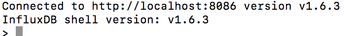

# 24

Time series DBMS의 2018년 Ranking은 다음과 같다



1위인 Influxdb를 사용하는 것이 좋을 것 같다


## 설치하기

설치 메뉴얼은 아래 링크\(brew로 설치\) 



```
$ influxd
```

실행시켜서 잘 되면 설치 완료

## Documentation !! 

사실 doc이 엄청 잘 되어 있어서 이거 보고 따라하면 다 됩니다. 지금부터 나오는 아래의 내용은 여기서 보고 따라한거 끄적끄적 한거라서 안봐도 됩니다.



## 시작하기

```text
$ influx -precision rfc3339
```

rfc3339는 시간 체계 중 하나. -precision으로 초기화 할 수 있음. 



**DB 생성**

```text
> CREATE DATABASE <db이름>
```

**DB 목록 확인**

```text
> SHOW DATABASES
```

**DB 선택**

```text
> USE <db이름>
```

Data 구조

Time series는 여러개의 points를 갖고, 각각의 **point**는 다음과 같은 요소로 구성되어 있다. 

* **time** : timestamp
* **measurement** : 테이블 
* **fields** : key-value 쌍 한개 이상. 스스로 측정된 값 \(예 : value=0.64, temperature=21.2\)
* **tags** : 0개 이상의 key-value쌍. value에 대한 metadata 아무거나 \(예: host=server01, region=EMEA, dc=Frankfurt\)

measurement는 SQL의 테이블\(primary index는 시간\)

tags, fields는 coulumn\(tag는 indexed, field는 아님\)


SQL과 InfluxDB의 차이점

1. 엄청난 갯수의 measurement를 가질 수 있음
2. 스키마 정의 필요 없음
3. null 값은 저장되지 않음


Point의 형식 - Line Protocol

```text
<measurement>[,<tag-key>=<tag-value>...] <field-key>=<field-value>[,<field2-key>=<field2-value>...] [unix-nano-timestamp]
```

Line Protocal의 자세한 syntax는 [https://docs.influxdata.com/influxdb/v1.6/write\_protocols/line\_protocol\_reference/\#syntax](https://docs.influxdata.com/influxdb/v1.6/write_protocols/line_protocol_reference/#syntax) 참고

examples of points that can be written to InfluxDB

```text
cpu,host=serverA,region=us_west value=0.64
payment,device=mobile,product=Notepad,method=credit billed=33,licenses=3i 1434067467100293230
stock,symbol=AAPL bid=127.46,ask=127.48
temperature,machine=unit42,type=assembly external=25,internal=37 1434067467000000000
```

하나만 뽑아서 설명해보면,

```text
cpu,host=serverA,region=us_west value=0.64
```

measurement 이름은 cpu, tags는 host와 region, field는 value\(measured value\)

tag는 붙여서 쓰고, field는 공백 이후로 구분


**하나의 point 삽입하기**

```text
> INSERT <point내용>
```

**쿼리문**

```text
>SELECT <컬럼-field,tags이름> FROM <테이블-measurement이름>
```

예\) 아래와 같이 조회하면

```text
> SELECT "host", "region", "value" FROM "cpu"
```

time과 내가 지정한 컬럼의 값이 같이 나온다.

select \* from &lt;테이블이름&gt; : 전체 조회  \( LIMIT없이 쓰면 계속 쭉 나오니까 Ctrl+C로 멈추기\)


그 밖에 다양하게 쿼리문을 때릴 수 있다

```text
> SELECT * FROM /.*/ LIMIT 1
--
> SELECT * FROM "cpu_load_short"
--
> SELECT * FROM "cpu_load_short" WHERE "value" > 0.9
```


여기까지가 기본. 자세한 Writing/Querying은 다음 가이드에

