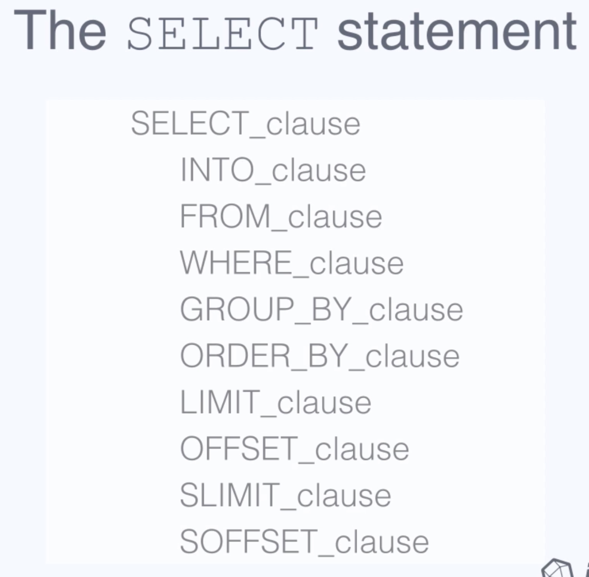

# 25

## InfulxDB로 데이터를 읽고 쓰는 세가지 방법

1. CLI : Command Line Interface
2. Client Library : 언어별로 라이브러리 받아서 사용\(node.js, go 등 거의 모든 언어 지원\) _**=&gt; 이 방법으로 하세여!!!!!**_
3. HTTP API : HTTP Request보내서 읽고 쓰기 _=&gt; 아니면 이거?로 해도 될듯_

## Writing Data

아래의 링크는 writing에 대한 doc



지금부터, CLI가 아닌 HTTP API를 이용해서 Data를 Write하는 방법을 알아보자

curl로 HTTP Request를 때려서 Data를 쓴다


**Create Database**

```text
$curl -i -XPOST http://localhost:8086/query --data-urlencode "q=CREATE DATABASE <db이름>"
```

POST 로, url은 /query, db이름과 endpoint 주소 입력. q=  뒤에 쿼리문

커맨드창에서 입력하면 200 OK응답을 받는다.

CLI에서 확인해보면, db가 잘 생긴걸 확인할 수 있다.


**Writing data using HTTP API**

```bash
$curl -i -XPOST 'http://localhost:8086/write?db=mydb' --data-binary 'cpu_load_short,host=server01,region=us-west value=0.64 1434055562000000000'
```

POST, url은 /write , 반드시 db이름을 명시해줘야 한다.

The example below writes a single point to the `mydb` database. The data consist of the [measurement](https://docs.influxdata.com/influxdb/v1.6/concepts/glossary/#measurement) `cpu_load_short`, the [tag keys](https://docs.influxdata.com/influxdb/v1.6/concepts/glossary/#tag-key) `host` and `region` with the [tag values](https://docs.influxdata.com/influxdb/v1.6/concepts/glossary/#tag-value) `server01` and `us-west`, the [field key](https://docs.influxdata.com/influxdb/v1.6/concepts/glossary/#field-key) `value` with a [field value](https://docs.influxdata.com/influxdb/v1.6/concepts/glossary/#field-value) of `0.64`, and the [timestamp](https://docs.influxdata.com/influxdb/v1.6/concepts/glossary/#timestamp) `1434055562000000000`. 

`rp` query parameter로 retention policy 지정 가능


**Writing Multiple Points**

```text
curl -i -XPOST 'http://localhost:8086/write?db=mydb' --data-binary 'cpu_load_short,host=server02 value=0.67
cpu_load_short,host=server02,region=us-west value=0.55 1422568543702900257
cpu_load_short,direction=in,host=server01,region=us-west value=2.0 1422568543702900257'
```

여러개의 point를 한 번에 쓸 수있다. ' ' 안에서 공백으로 구분


**Writing data from file**

curl의 인자로 파일 이름을 넣어서, 파일의 내용을 그대로 point로 쓸 수 있다

```text
curl -i -XPOST 'http://localhost:8086/write?db=mydb' --data-binary @cpu_data.txt
```

\*\* 주의 : 5000points넘으면 파일 나누는 것이 좋다!


**그 밖에 알아둬야 할 사실**

* 맨 처음에 measurement에 write한 타입으로 필드나 태그의 타입이 정의된다. 처음에 선언한 타입과 다른 타입의 데이터를 write하려고 하면 4xx 에러가 난다!
* \*\*\*\*[**https://docs.influxdata.com/influxdb/v1.6/write\_protocols/line\_protocol\_reference/\#field-type-discrepancies**](https://docs.influxdata.com/influxdb/v1.6/write_protocols/line_protocol_reference/#field-type-discrepancies) **&lt;- 여기에 line protocol의 syntax에 대한 설명이 잘 나와있다. 참고하기!**
* double quote, single quote에 대한 룰도 정해져 있다. 대부분은 never인데, field의 value에만 double quote!!!!!! 다른데에 쌍따옴표 하면 에러남
* \  필요!!

For tag keys, tag values, and field keys always use a backslash character `\` to escape:

* commas `,`
* equal signs `=`
* spaces

For measurements always use a backslash character `\` to escape:

* commas `,`
* spaces

For string field values use a backslash character `\` to escape:

* double quotes `"`

## Querying Data

아래의 링크는 querying에 대한 doc



**Single Query문**

To perform a query send a `GET` request to the `/query` endpoint, set the URL parameter `db` as the target database, and set the URL parameter `q` as your query. You may also use a `POST` request by sending the same parameters either as URL parameters or as part of the body with `application/x-www-form-urlencoded`. The example below uses the HTTP API to query the same database that you encountered in [Writing Data](https://docs.influxdata.com/influxdb/v1.6/guides/writing_data/). 

```text
$curl -G 'http://localhost:8086/query?pretty=true' --data-urlencode "db=mydb" --data-urlencode "q=SELECT \"value\" FROM \"cpu_load_short\" WHERE \"region\"='us-west'"
```

InfluxDB는 JSON을 리턴한다.\(pretty=true를 붙이면 json이 예쁘게 정렬되어서 리턴된다. 안붙이면 그냥 리턴\). The results of your query appear in the `"results"` array. If an error occurs, InfluxDB sets an `"error"` key with an explanation of the error. 

```text
{
    "results": [
        {
            "statement_id": 0,
            "series": [
                {
                    "name": "cpu_load_short",
                    "columns": [
                        "time",
                        "value"
                    ],
                    "values": [
                        [
                            "2015-01-29T21:55:43.702900257Z",
                            2
                        ],
                        [
                            "2015-01-29T21:55:43.702900257Z",
                            0.55
                        ],
                        [
                            "2015-06-11T20:46:02Z",
                            0.64
                        ]
                    ]
                }
            ]
        }
    ]
}
```

**Multiple Query문**

세미콜론!으로 구분하여 여러개의 쿼리문을 한번의 API call에 때릴 수 있다.

```text
curl -G 'http://localhost:8086/query?pretty=true' --data-urlencode "db=mydb" --data-urlencode "q=SELECT \"value\" FROM \"cpu_load_short\" WHERE \"region\"='us-west';SELECT count(\"value\") FROM \"cpu_load_short\" WHERE \"region\"='us-west'"
```

JSON으로 리턴되는 결과가 statement\_id로 구분되어 리턴된다.

```text
{
    "results": [
        {
            "statement_id": 0,
            "series": [
                {
                    "name": "cpu_load_short",
                    "columns": [
                        "time",
                        "value"
                    ],
                    "values": [
                        [
                            "2015-01-29T21:55:43.702900257Z",
                            2
                        ],
                        [
                            "2015-01-29T21:55:43.702900257Z",
                            0.55
                        ],
                        [
                            "2015-06-11T20:46:02Z",
                            0.64
                        ]
                    ]
                }
            ]
        },
        {
            "statement_id": 1,
            "series": [
                {
                    "name": "cpu_load_short",
                    "columns": [
                        "time",
                        "count"
                    ],
                    "values": [
                        [
                            "1970-01-01T00:00:00Z",
                            3
                        ]
                    ]
                }
            ]
        }
    ]
}
```

**Timestamp 의 format 지정**

If you want timestamps in Unix epoch format include in your request the query string parameter `epoch` where `epoch=[h,m,s,ms,u,ns]`. For example, get epoch in seconds with: 

```text
curl -G 'http://localhost:8086/query' --data-urlencode "db=mydb" --data-urlencode "epoch=s" --data-urlencode "q=SELECT \"value\" FROM \"cpu_load_short\" WHERE \"region\"='us-west'"
```


**Authentication**

InfluxDB에서 Authentication은 default로 disable되어있다. auth 관련 설정하려면 아래의 doc 참고

[https://docs.influxdata.com/influxdb/v1.6/administration/authentication\_and\_authorization/](https://docs.influxdata.com/influxdb/v1.6/administration/authentication_and_authorization/)


**Chunking**

응답을 쪼갤 수 있다.

chunked = true 로. chunked-size도 지정 가능하다\(만포인트 단위 or series 단위\)

```text
curl -G 'http://localhost:8086/query' --data-urlencode "db=deluge" --data-urlencode "chunked=true" --data-urlencode "chunk_size=20000" --data-urlencode "q=SELECT * FROM liters"
```


그 외에 Query문 syntax는 아래 링크 참고!

[https://docs.influxdata.com/influxdb/v1.6/query\_language/data\_exploration/](https://docs.influxdata.com/influxdb/v1.6/query_language/data_exploration/)


**Common Issue!! 중요 중요!!**

1. 반드시 하나 이상의 field를 포함해야 한다. \(tag만 있으면 에러남~\)

A query requires at least one [field key](https://docs.influxdata.com/influxdb/v1.6/concepts/glossary/#field-key) in the `SELECT` clause to return data. If the `SELECT` clause only includes a single [tag key](https://docs.influxdata.com/influxdb/v1.6/concepts/glossary/#tag-key) or several tag keys, the query returns an empty response. This behavior is a result of how the system stores data.

2. select문 구조




## Key Concept

InfluxDB의 핵심 컨셉에 대한 설명



* tag는 Indexing이 안되니까 조회할 때 훨씬 빠르다
* A single measurement can belong to different retention policies. A _**retention policy**_ describes how long InfluxDB keeps data \(`DURATION`\) and how many copies of those data are stored in the cluster \(`REPLICATION`\). If you’re interested in reading more about retention policies, check out [Database Management](https://docs.influxdata.com/influxdb/v1.6/query_language/database_management/#retention-policy-management).
* In InfluxDB, a _**series**_ is the collection of data that share a retention policy, measurement, and tag set.
* a _**point**_ is the field set in the same series with the same timestamp


**예시\)**

4개의 Series

| Arbitrary series number | Retention policy | Measurement | Tag set |
| :--- | :--- | :--- | :--- |
| series 1 | `autogen` | `census` | `location = 1`,`scientist = langstroth` |
| series 2 | `autogen` | `census` | `location = 2`,`scientist = langstroth` |
| series 3 | `autogen` | `census` | `location = 1`,`scientist = perpetua` |
| series 4 | `autogen` | `census` | `location = 2`,`scientist = perpetua` |

하나의 Point

```text
name: census
-----------------
time                    butterflies honeybees   location    scientist
2015-08-18T00:00:00Z    1           30          1           perpetua
```

The series in the example is defined by the retention policy \(`autogen`\), the measurement \(`census`\), and the tag set \(`location = 1`, `scientist = perpetua`\). The timestamp for the point is `20`

