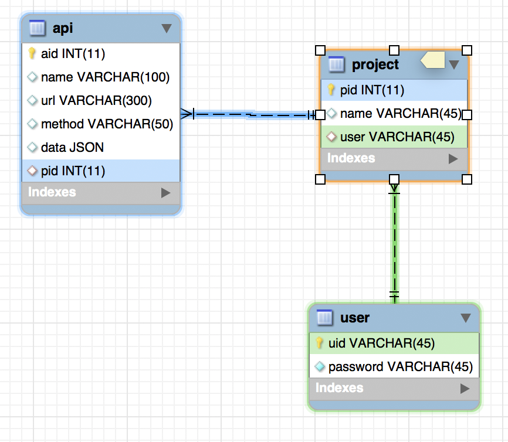
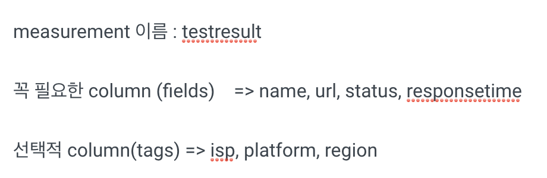

# 04

RDBMS



Time Series DB

measurement\(sql의 테이블\)을 자유롭게, 엄청 많이, 언제든 생성할 수 있기 때문에 api별로, project별로 계속 샤딩하듯이 measurement를 만들어도 된다.

테이블 정의는 다음과 같다.



dummy로 사용한 point들

```text
testresult,isp=kt,testresult,isp=kt,platform=android,region=seoul name="signup",url="https://www.redstop.com/signup",method="POST",status=200,responsetime=3177
testresult,isp=skt,platform=ios,region=seoul name="signup",url="https://www.redstop.com/signup",method="POST",status=200,responsetime=1347
testresult,isp=lguplus,platform=android,region=seoul name="signup",url="https://www.redstop.com/signup",method="POST",status=200,responsetime=9479
testresult,isp=skt,platform=android,region=seoul name="rank",url="https://www.redstop.com/rank",status=200,method="GET",responsetime=1234
testresult,isp=kt,platform=android,region=seoul name="signin",url="https://www.redstop.com/signin",status=200,method="POST",responsetime=1133
testresult,isp=skt,platform=ios,region=seoul name="signin",url="https://www.redstop.com/signin",status=400,method="POST",responsetime=1342
testresult,isp=skt,platform=android,region=seoul name="signin",url="https://www.redstop.com/signin",status=400,method="POST",responsetime=1111
testresult,isp=lguplus,platform=ios,region=seoul name="rank",url="https://www.redstop.com/rank",status=400,method="GET",responsetime=1331
testresult,isp=skt,platform=android,region=seoul name="bloglist",url="https://www.redstop.com/blog/list",status=200,method="GET",responsetime=3283
testresult,isp=kt,platform=android,region=seoul name="bloglist",url="https://www.redstop.com/blog/list",status=200,method="GET",responsetime=1083
testresult,isp=skt,platform=ios,region=seoul name="bloglist",url="https://www.redstop.com/blog/list",status=200,method="GET",responsetime=9993
testresult,isp=kt,platform=ios,region=seoul name="bloglist",url="https://www.redstop.com/blog/list",status=200,method="GET",responsetime=9192
testresult,isp=skt,platform=ios,region=seoul name="rank",url="https://www.redstop.com/rank",status=200,method="GET",responsetime=9993
=android,region=seoul name="signup",url="https://www.redstop.com/signup",status=200,responsetime=3177
```

point하나의 문법 - line protocol

```text
<measurement>[,<tag-key>=<tag-value>...] <field-key>=<field-value>[,<field2-key>=<field2-value>...] [unix-nano-timestamp]
```

[https://docs.influxdata.com/influxdb/v1.6/write\_protocols/line\_protocol\_reference/\#syntax](https://docs.influxdata.com/influxdb/v1.6/write_protocols/line_protocol_reference/#syntax)

데이터 삽입

```text
> insert [point하나]
```

Timestamp 형식 변경

처음에 시작할 때 precision을 지정하면 된다. rfc3339로 하자

```text
$influx -precision rfc3339
```

```text
> show databases
> use redstop
> show measurements
> select * from testresult

```


테이블 삭제

```text
drop measurement [measurement이름]
```


