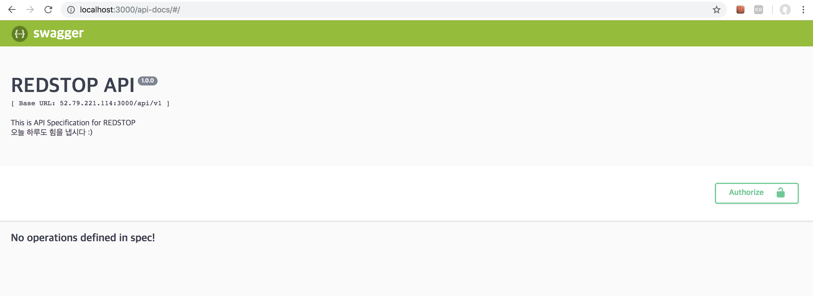
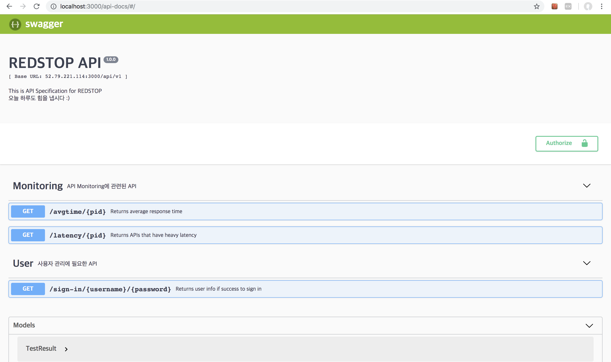

# Swagger - nodejs

## Nodejs 서버에서 Swagger spec 사용하기

**1단계. 설치하기**

```
npm install swagger-ui-express --save
npm install swagger-jsdoc
```


**2단계. Swagger 전용 파일 만들기**

AVSwagger.js 파일을 만들고 아래와 같은 내용을 넣는다.

```
const swaggerJSDoc  = require('swagger-jsdoc');
const swaggerUi     = require('swagger-ui-express');

// Swagger definition
// You can set every attribute except paths and swagger
// https://github.com/swagger-api/swagger-spec/blob/master/versions/2.0.md
var swaggerDefinition = {
    info: {                                             // API informations (required)
        title: 'REDSTOP API',                            // Title (required)
        version: '1.0.0',                               // Version (required)
        description: 'This is API Specification for REDSTOP\n오늘 하루도 힘을 냅시다 :)', // Description (optional)
    },
    host: "52.79.221.114:3000",
    basePath: "/api/v1"                                     // v1,v2... 확장가능(swaggerDefinition,swaggerSpec도 버전별로 따로 생성해야 함)
};

// Options for the swagger docs
var options = {
    swaggerDefinition: swaggerDefinition,               // Import swaggerDefinitions
    apis: [                                             // Path to the API docs
        'routes/api/*.js'                                 // v1,v2... 확장가능(swaggerDefinition,swaggerSpec도 버전별로 따로 생성해야 함)
    ]
};

// Initialize swagger-jsdoc -> returns validated swagger spec in json format
// 여기서 위에서 정의한 swaggerSpec을 export 시킨다.
var swaggerSpec = module.exports.swaggerSpec = swaggerJSDoc(options);

// Swagger UI
module.exports.swaggerUi = swaggerUi;

```


**3단계. app.js에 다음 코드 추가**

```text
// App Root Path
global.reqlib = require('app-root-path').require;

// Global Swagger
global.AVSwagger = reqlib('AVSwagger');

// Swagger API 명세를 볼수 있는 URL을 맵핑
app.use('/api-docs', AVSwagger.swaggerUi.serve, AVSwagger.swaggerUi.setup(AVSwagger.swaggerSpec));

```


여기까지 하고 서버 켜고 [http://localhost:3000/api-docs/\#/](http://localhost:3000/api-docs/#/) 로 접속해보면




**4단계. routes 폴더의 각 API에서 명세하기**

YAML 형태로 맨 위에 주석을 달면 된다. \(JSON도 되는데 주로 YAML을 쓴다\)

예시\)

```text
/**
 * @swagger
 * tags:
 * - name: Monitoring
 *   description: API Monitoring에 필요한 API입니다.
 */

/**
 * @swagger
 * /avgtime/{pid}:
 *   get:
 *     tags:
 *     - "Monitoring"
 *     summary: Returns average response time
 *     description: "한 Project의 평균 응답 시간을 리턴합니다"
 *     produces:
 *     - "application/json"
 *     parameters:
 *     - name: "pid"
 *       in: "path"
 *       description: "Project ID"
 *       required: true
 *       type: "integer"
 *       format: "int64"
 *     responses:
 *       200:
 *         description: Successful operation
 *         schema:
 *           type: object
 *           properties:
 *             avgtime:
 *               type: "number"
 *               format: "double"
 *       500:
 *         description : Database Error
 */
```

샘플링크\) 여기 들어가서 참고해서 확인하면서 하면 쉽게 만들 수 있다.




이제 끝!

API 여러개 정의하고 다시 [http://localhost:3000/api-docs/\#/](http://localhost:3000/api-docs/#/) 접속하면




